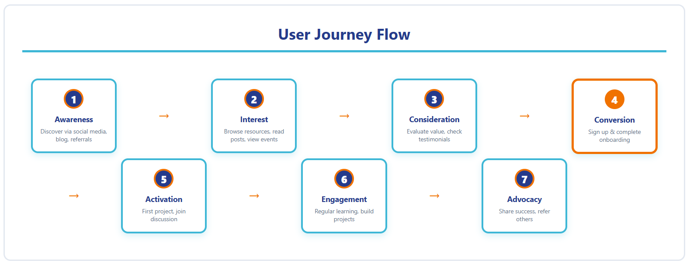

# Customer Journey Map: Job Club Member

*Visual customer journey diagram*

## Journey Overview
**Goal**: Transform from AI-curious student to career-ready professional

**Timeline**: Semester-long engagement (3-6 months)

---

## Stage 1: Awareness 🔍
*"I've heard about AI, but how does it affect my career?"*

### Touchpoints
- Social media posts about AI and career preparation
- Word of mouth from other students
- University career center references
- Blog posts on AI job market reality

### User Actions
- Googles "AI career preparation"
- Reads blog posts about AI skills
- Asks friends about AI learning resources
- Visits Job Club website

### Thoughts & Feelings
- 😰 Anxious about being left behind
- 🤔 Curious but overwhelmed
- 📚 Wants to learn but unsure where to start

### Pain Points
- Information overload about AI
- Unclear which resources are credible
- Don't know if Job Club is right for them

### Opportunities
- Clear value proposition on homepage
- Testimonials from students like them
- "Start Here" guide for new visitors
- Low-barrier entry point (newsletter, free resource)

---

## Stage 2: Consideration 🤝
*"Should I join Job Club? What's in it for me?"*

### Touchpoints
- About page and mission
- Blog content showcasing thinking
- Onboarding guide preview
- Community showcase

### User Actions
- Explores website thoroughly
- Reads multiple blog posts
- Compares to other communities (MLH, career centers)
- Checks what resources are available

### Thoughts & Feelings
- 🤔 Evaluating fit and value
- 💭 Imagining themselves as part of community
- ⚖️ Weighing time commitment vs. benefits

### Pain Points
- Unclear what "membership" entails
- Uncertain about time commitment
- Wondering if it's "worth it"

### Opportunities
- Clear onboarding expectations
- Sample projects and learning paths
- Transparent time commitments
- Quick wins for new members

---

## Stage 3: Onboarding 🚀
*"How do I get started and add value?"*

### Touchpoints
- Welcome email/message
- Onboarding guide
- First project or learning path
- Introduction to community channels

### User Actions
- Completes onboarding checklist
- Introduces themselves to community
- Chooses first learning path or project
- Sets up profile/portfolio

### Thoughts & Feelings
- 😊 Excited to start
- 😅 Slightly nervous about fitting in
- 🎯 Motivated to prove value

### Pain Points
- Onboarding might feel overwhelming
- Not sure how to introduce themselves
- Analysis paralysis on choosing first project

### Opportunities
- Structured onboarding checklist
- "Introduce yourself" template
- Recommended first projects
- Buddy/mentor system
- Quick wins in first week

---

## Stage 4: Active Participation 💪
*"I'm building skills and making connections"*

### Touchpoints
- Weekly community discussions
- Project collaboration tools
- Learning resources library
- Showcase/demo opportunities
- Peer feedback sessions

### User Actions
- Works on AI projects
- Participates in discussions
- Helps other members
- Attends events/workshops
- Shares progress and learnings

### Thoughts & Feelings
- 🌟 Growing confidence in AI skills
- 🤝 Feeling part of a community
- 📈 Seeing tangible progress
- 💡 Generating ideas and insights

### Pain Points
- Time management with coursework
- Occasional imposter syndrome
- Keeping momentum during busy periods
- Finding right project difficulty level

### Opportunities
- Flexible participation models
- Recognition for contributions
- Peer support and encouragement
- Progressive skill levels
- Regular check-ins and milestones

---

## Stage 5: Career Preparation 🎯
*"I'm ready to enter the job market"*

### Touchpoints
- Portfolio review sessions
- Resume/interview prep resources
- Industry connections and networking
- Job board or opportunities
- Career guidance content

### User Actions
- Builds portfolio showcasing projects
- Updates resume with AI skills
- Practices interview questions
- Networks with alumni/industry
- Applies for jobs/internships

### Thoughts & Feelings
- 💼 Confident about AI capabilities
- 🎓 Prepared for career conversations
- 🤝 Leveraging community connections
- 🎯 Clear about career direction

### Pain Points
- Translating projects into resume bullets
- Articulating AI skills to non-technical recruiters
- Standing out in competitive market
- Negotiating offers without experience

### Opportunities
- Portfolio templates and examples
- Interview prep workshops
- Alumni mentor connections
- Mock interviews
- Offer negotiation guidance

---

## Stage 6: Advocacy & Alumni 🌟
*"Job Club helped me succeed—I want to give back"*

### Touchpoints
- Alumni network
- Mentorship opportunities
- Guest speaker invitations
- Success story features
- Referral program

### User Actions
- Mentors current members
- Shares job opportunities
- Gives back through workshops
- Refers friends to Job Club
- Shares success story

### Thoughts & Feelings
- 🙏 Grateful for community support
- 🎓 Proud of growth journey
- 🤝 Eager to help others
- 📢 Advocate for Job Club

### Pain Points
- Limited time as working professional
- Staying connected while busy
- Finding ways to contribute meaningfully

### Opportunities
- Flexible alumni engagement models
- Recognition for contributions
- Easy ways to give back (micro-mentoring)
- Alumni spotlight features
- Professional networking events

---

## Key Metrics by Stage

| Stage | Success Metrics |
|-------|----------------|
| **Awareness** | Website visits, blog readers, social engagement |
| **Consideration** | Time on site, pages visited, email signups |
| **Onboarding** | Onboarding completion rate, first project started |
| **Active Participation** | Weekly active users, projects completed, discussions participated |
| **Career Preparation** | Portfolio completions, job offers, interviews secured |
| **Advocacy** | Referrals made, mentorship sessions, alumni engagement |

---

## Critical Success Factors

1. **Clear Value Proposition**: Students understand why Job Club matters
2. **Low Barrier to Entry**: Easy to start, flexible commitment
3. **Quick Wins**: Early success builds momentum
4. **Community Connection**: Feel part of something bigger
5. **Practical Outcomes**: Tangible career preparation results
6. **Ongoing Support**: Resources available throughout journey
