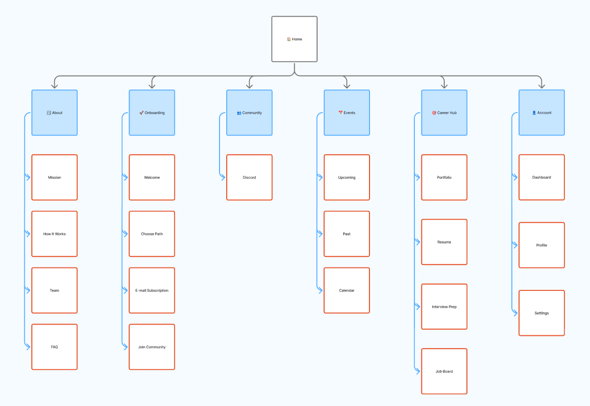

# Sitemap & Information Architecture


*Visual sitemap diagram*

## Site Structure Overview

```
Job Club
│
├── Home (/)
│
├── About (/about)
│   ├── Mission
│   ├── How It Works
│   ├── Team
│   └── FAQ
│
├── Onboarding (/onboarding)
│   ├── Welcome
│   ├── Choose Path
│   ├── Email Subscription
│   └── Join Community
│
├── Community (/community)
│   └── Discord
│
├── Events (/events)
│   ├── Upcoming
│   ├── Past
│   └── Calendar
│
├── Career Hub (/career)
│   ├── Portfolio Template
│   ├── Resume
│   └── Interview Prep
│
└── Account (/account)
    ├── Dashboard
    ├── Profile
    └── Settings
```

---

## Information Architecture Principles

### 1. User-Centered Navigation
- **Primary audience**: Students at various AI learning stages
- **Navigation reflects user journeys**: Discovery → Learning → Building → Career
- **Clear entry points**: Different paths for different personas

### 2. Progressive Disclosure
- **Surface essential information first**
- **Deep dive options available** for engaged users
- **Onboarding guides new users** to relevant sections

### 3. Findability
- **Multiple paths to content**: Navigation, search, recommendations
- **Clear labeling**: User language, not internal jargon
- **Breadcrumbs**: Always know where you are

---

## Primary Navigation Structure

### Top-Level Navigation
```
┌───────────────────────────────────────────────────────────┐
│  [Logo] Home  About  Community  Events  Career  [Account] │
└───────────────────────────────────────────────────────────┘
```

**Order rationale**:
1. **About** - Understand the mission
2. **Community** - Connect with members
3. **Events** - Engage with activities
4. **Career** - Prepare for the future

### Mobile Navigation
```
┌──────────────────┐
│  ☰  Job Club  👤 │
├──────────────────┤
│  Home            │
│  About           │
│  Community       │
│  Events          │
│  Career Hub      │
│  Account         │
└──────────────────┘
```

---

## Page-Level Architecture

### Homepage
**Purpose**: Orient, inspire, convert visitors to members

**Information Hierarchy**:
1. **Hero Section**
   - Value proposition
   - Primary CTA (Start Onboarding)
   - Visual hook

2. **Social Proof**
   - Member count
   - Success metrics
   - Testimonials

3. **How It Works**
   - 3-4 step process
   - Link to About page

4. **Quick Links**
   - Latest blog posts
   - Upcoming events
   - Project showcase

5. **Call to Action**
   - Start onboarding
   - Explore resources

---

### Onboarding Flow
**Purpose**: Guide new members to first value

**Steps** (4-screen flow):

**Screen 1: Welcome**
- Welcome message
- What to expect
- Estimated time (3 min)

**Screen 2: Choose Path**
- Select persona/experience level
- Beginner / Intermediate / Advanced
- Career goals selection

**Screen 3: Email Subscription**
- Subscribe to updates
- Frequency preferences
- Content interests

**Screen 4: Join Community**
- Connect to Discord
- Community guidelines
- Get started in Discord

---

### About Page
**Purpose**: Explain Job Club's mission and how it works

**Information Architecture**:

**Mission Section**
- Vision statement
- Why Job Club exists
- Core values

**How It Works**
- Step-by-step process
- Member journey
- Value proposition

**Team**
- Leadership bios
- Advisors
- Contact information

**FAQ**
- Common questions
- Getting started help
- Technical support

---

### Events Page
**Purpose**: Showcase community activities, drive participation

**Information Architecture**:

**Upcoming Events**
- Featured event (hero)
- Event cards with:
  - Title, date, time
  - Format (virtual/in-person)
  - Brief description
  - RSVP button
- Filter by: format, topic, date

**Past Events**
- Event archive
- Recordings (if available)
- Event summaries
- Key takeaways

**Calendar View**
- Monthly calendar grid
- Event markers
- Quick view details
- Export to personal calendar

---

### Community Page
**Purpose**: Connect members to Discord community

**Information Architecture**:

**Discord Integration**
- Discord server invite
- Channel overview
- Community guidelines
- Getting started guide
- Member count/activity stats

### Career Hub
**Purpose**: Support career preparation and job search

**Information Architecture**:

```
Career Hub
│
├── Portfolio Template
│   ├── Template gallery
│   ├── Customization guide
│   └── Portfolio examples
│
├── Resume
│   ├── AI-focused resume templates
│   ├── Resume writing tips
│   └── Cover letter guides
│
└── Interview Prep
    ├── Common AI interview questions
    ├── Mock interview resources
    └── Behavioral interview guide
```

---

### Account Pages
**Purpose**: Personal dashboard and settings

**Information Architecture**:

**Dashboard**
- Activity overview
- Upcoming events
- Recent updates
- Quick actions

**Profile**
- Personal information
- Bio and interests
- Social links
- Privacy settings

**Settings**
- Account preferences
- Email notifications
- Privacy controls
- Connected accounts

---

## User Flows

### New Visitor → Member Flow
```
1. Land on Homepage
   ↓
2. Browse content (Blog, Events, Projects)
   ↓
3. Click "Get Started" CTA
   ↓
4. Complete Onboarding (4 screens)
   ↓
5. Join Discord Community
   ↓
6. Access Member Dashboard
```

### Member Engagement Flow
```
1. Dashboard
   ↓
2. Discover upcoming events
   ↓
3. RSVP to event
   ↓
4. Participate in event
   ↓
5. Connect on Discord
   ↓
6. Continue engagement
```

### Career Preparation Flow
```
1. Career Hub
   ↓
2. Choose portfolio template
   ↓
3. Customize portfolio
   ↓
4. Create/update resume
   ↓
5. Practice interview prep
   ↓
6. Share success on Discord
```

---

## Navigation Patterns

### Global Navigation (All Pages)
- **Header**: Logo, primary nav, search, account
- **Footer**: Secondary links, social, newsletter signup
- **Breadcrumbs**: For deep pages (>2 levels)

### Contextual Navigation
- **Related Resources**: "You might also like..."
- **Next Steps**: "Ready for the next step?"
- **Community Suggestions**: "Members are discussing..."

### User Account Navigation
```
Account Menu (Dropdown)
│
├── Dashboard
├── Profile
├── Settings
└── Logout
```

---

## Search Strategy

### Global Search
- **Location**: Header (all pages)
- **Searches across**: Events, Career Resources
- **Features**:
  - Auto-complete suggestions
  - Recent searches
  - Popular searches
  - Filter results by type

### Contextual Search
- **Events**: Search by date, topic, format
- **Career Hub**: Search templates and resources

---

## Content Taxonomy

### Primary Categories
1. **Community**
   - Discord channels
   - Member connections
   - Community guidelines

2. **Events**
   - Workshops
   - Discussions
   - Social meetups

3. **Career Resources**
   - Portfolio templates
   - Resume templates
   - Interview preparation

### Tags System
- **Skill Level**: Beginner, Intermediate, Advanced
- **Event Type**: Workshop, Social, Discussion
- **Format**: Virtual, In-person, Hybrid
- **Resource Type**: Template, Guide, Reference

---

## Mobile-First Considerations

### Mobile Navigation Priority
1. **Bottom Navigation** (Primary actions)
   - Home
   - Events
   - Community
   - Account

2. **Hamburger Menu** (Secondary pages)
   - About
   - Career Hub

### Mobile Content Strategy
- **Card-based layouts**: Easily scannable
- **Progressive disclosure**: Show summaries, expand for details
- **Touch-friendly**: Buttons min 44x44px
- **Responsive design**: Optimized for all screen sizes

---

## Accessibility Considerations

### Navigation
- **Keyboard navigation**: Tab through all interactive elements
- **Skip links**: Jump to main content
- **ARIA labels**: Screen reader friendly
- **Focus indicators**: Clear visual focus states

### Content Hierarchy
- **Semantic HTML**: Proper heading structure (H1-H6)
- **Landmarks**: Main, nav, aside, footer
- **Alt text**: All images and icons
- **Color contrast**: WCAG AA minimum (4.5:1)

---

## Scalability Plan

### Future Expansion Areas
1. **Resource Library** (curated learning content)
2. **Project Showcase** (member portfolios)
3. **Blog** (insights and member stories)
4. **Mentorship Portal** (dedicated mentorship matching)
5. **Job Board** (internships and entry-level roles)

### IA Flexibility
- **Modular structure**: Easy to add new sections
- **Consistent patterns**: Reusable templates
- **Clear hierarchy**: Room for growth without complexity
